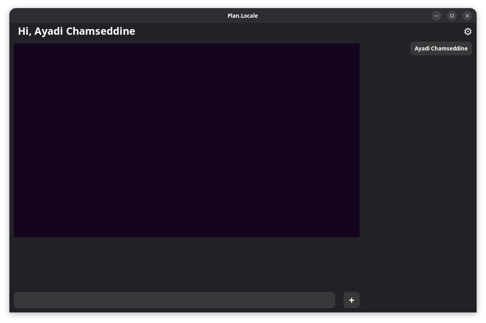

# Plan.Locale
</img>

A cross platform multi-threading pear to pear chating app was programed in C++

this  app still on alpha, aka prototype, aka not stabel

it uses:
- ASIO as the network library
- wxWidgets as the gui library
- OpenCV for camera capturing
- PortAudio for Audio capturing

it can:
- share camera video / audio
- sende mesages 
- sende files

*AND No Server betwen them, you device is a server and a cleint in the same time*

the code it selfe is expermentale, but i still devolping it to make it as stabel as posible

tbh, what do you think, i speed run makeing it for a competition, and it is the probably the worst code that i ever made
